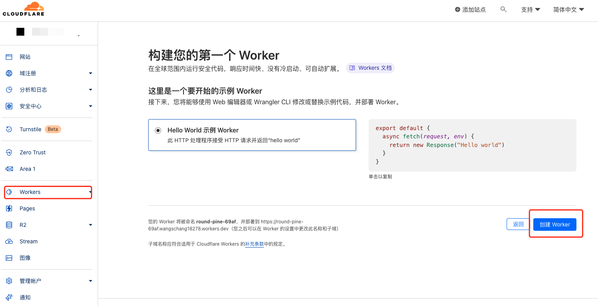
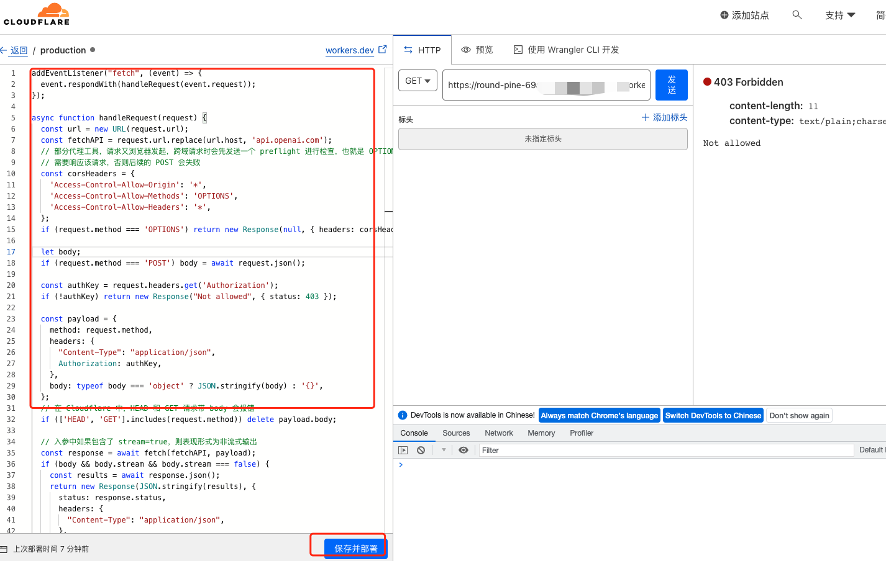
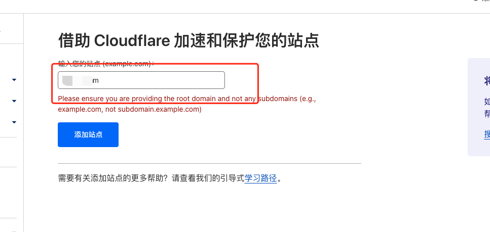
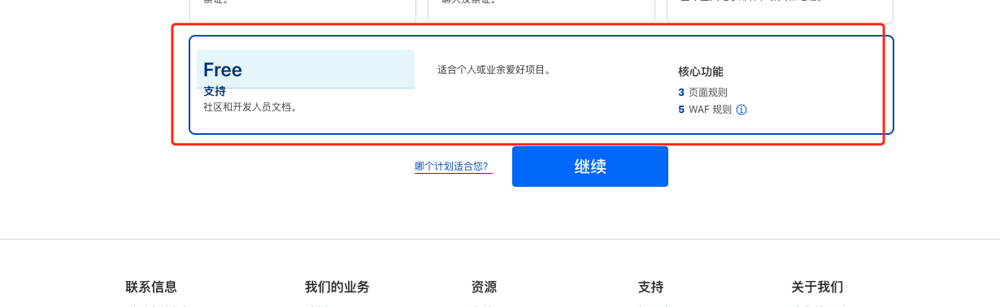
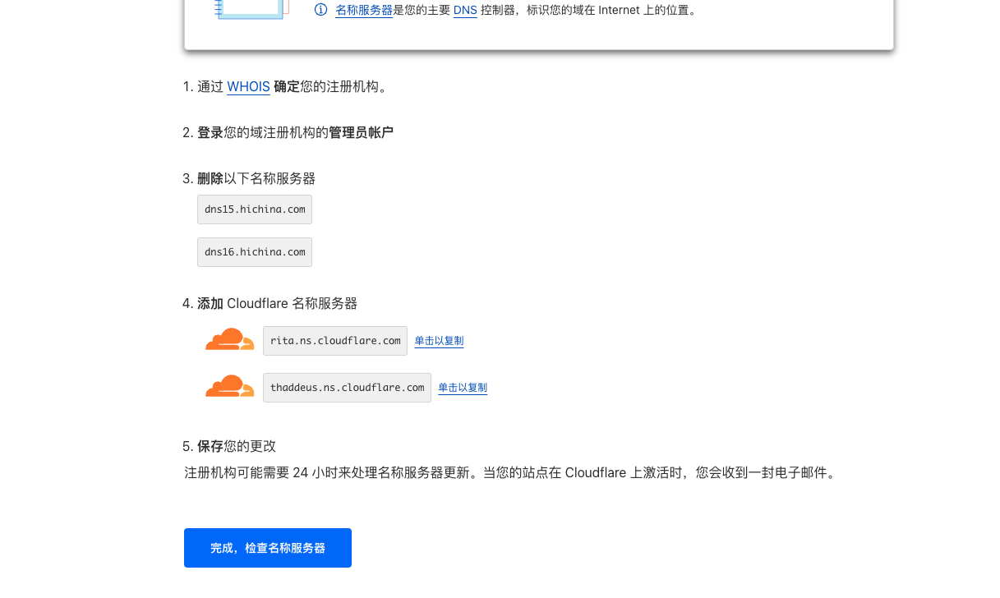
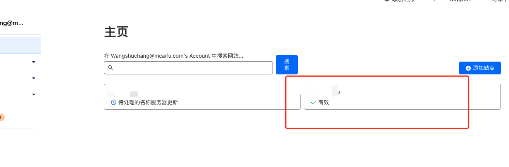

#cloudflare配置代理域名

##操作步骤

###1. 注册账号并验证邮箱 [https://www.cloudflare.com/](https://www.cloudflare.com/) 

###2. 打开网页 [https://dash.cloudflare.com/](https://dash.cloudflare.com/) 开始创建worker
   

###3. 打开页面 左侧输入附件的代码
 代码来源：[https://github.com/barretlee/cloudflare-proxy](https://github.com/barretlee/cloudflare-proxy)
   
   并保存提交
   
   
   
###4.配置域名ns指向到cloudflare.com 最好是没有被解析的域名
   在cloudflare 网站---添加站点 
   选择免费后继续
   
    
    
    
    
    
    
   点继续 
    
   到域名购买地方 设置ns
   阿里云为例：
   域名控制台--域名列表---选择具体的域名---管理---DNS修改
   修改为
   rita.ns.cloudflare.com
   thaddeus.ns.cloudflare.com
   
   等待域名生效，生效后能看到生效的标记
    
   
     
###5.点击之前配置的 workder里面的代理的详情，点击触发器，添加自定义域名 可以是一个二级域名等待生效即可

参考：

https://github.com/noobnooc/noobnooc/discussions/9

https://github.com/barretlee/cloudflare-proxy

 

