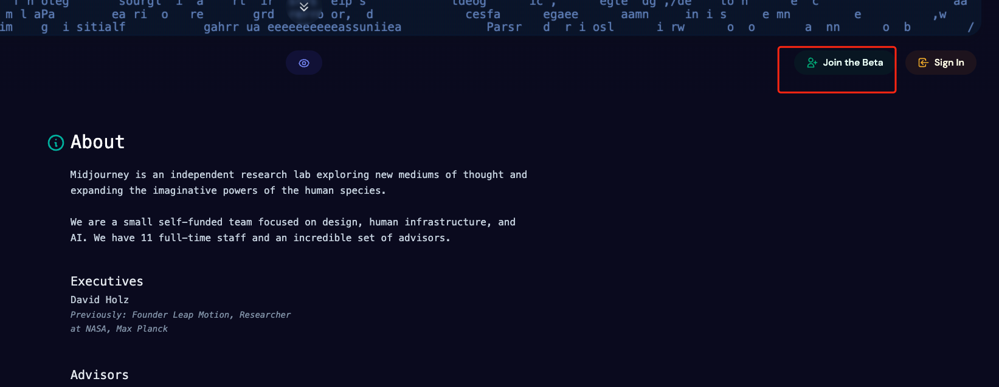
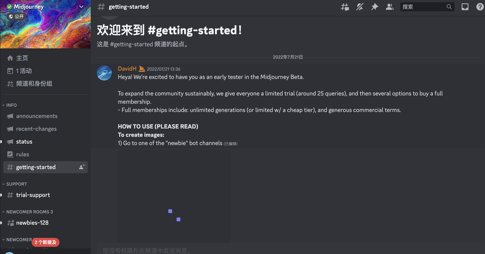
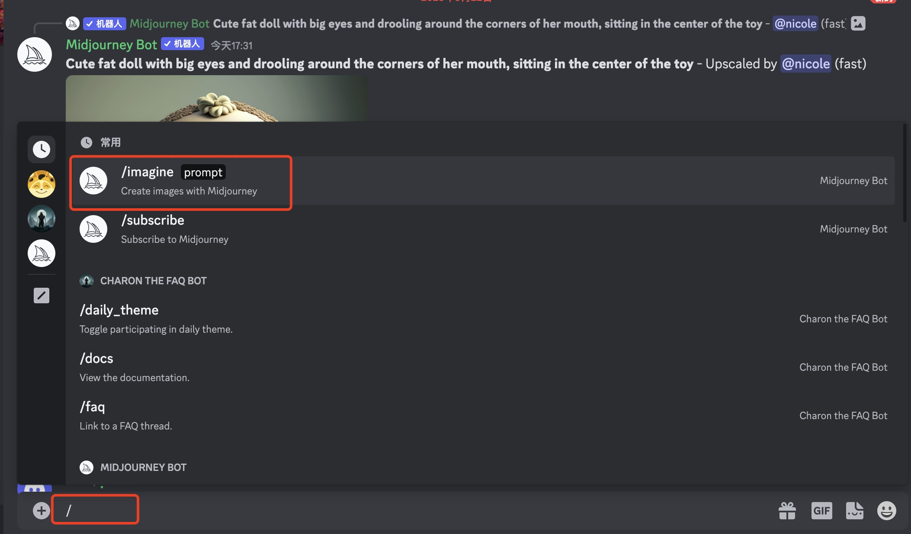
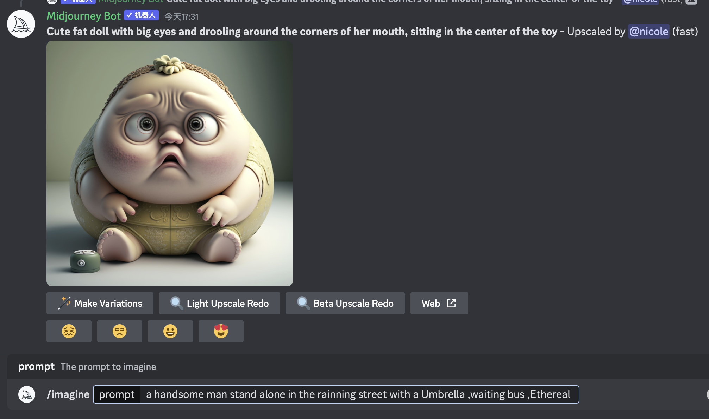
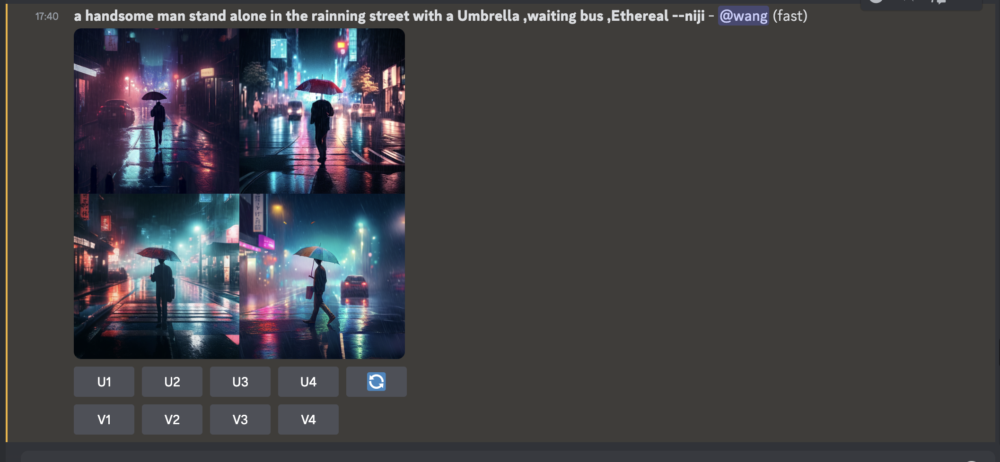
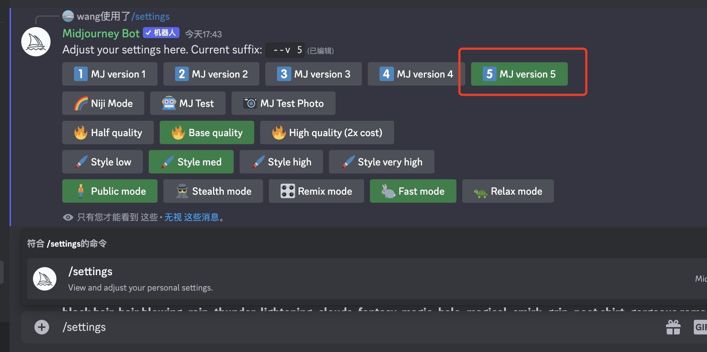

#midjourney使用

##前提条件 
1.梯子软件(可以全局代理)

2.Discord

##使用步骤

###1. 下载  discord 可以手机或者电脑客户端 [https://discord.com/download](https://discord.com/download) 

###2. 下载后自行安装注册并登录

###3. 打开网页 [https://www.midjourney.com/home/](https://www.midjourney.com/home/) 点击右上角 Join the Beta 
   

###4. 或者直接打开地址 [https://discord.gg/midjourney](https://discord.gg/midjourney)  并加入到Midjourny 中 加入后会是如下的样子
   
   可以看下里面的说明和使用方法
   
   1) Go to one of the "newbie" bot channels 

   2) Type /imagine and then whatever you want
   
   3) The bot will send you 4 images in 60 seconds
   
###5.加入后会出现 NEWCOMER ROOM 进入其中一个频道
    
   输入 /imagine 和对应的描述即可生成图片
   
   还可以通过 /settings 设置使用的引擎版本
   
   
   
   
   
   
###6.可以通过教程配置一些参数

 [https://github.com/willwulfken/MidJourney-Styles-and-Keywords-Reference](https://github.com/willwulfken/MidJourney-Styles-and-Keywords-Reference)
 

