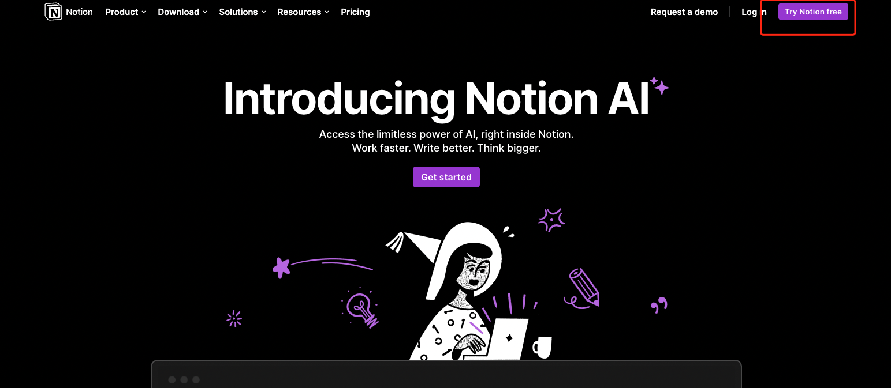
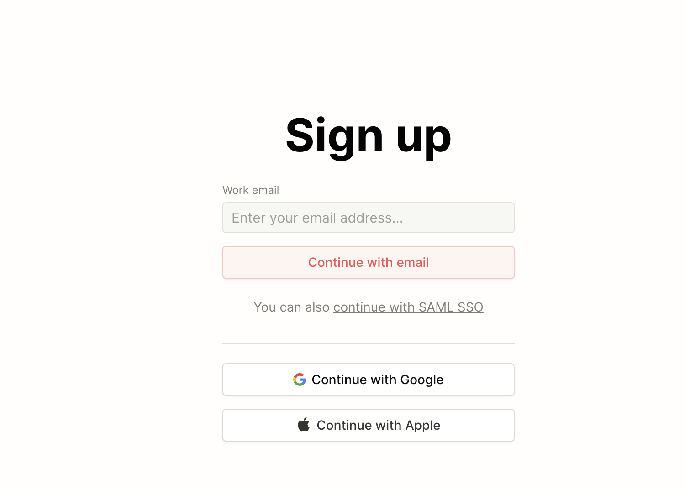
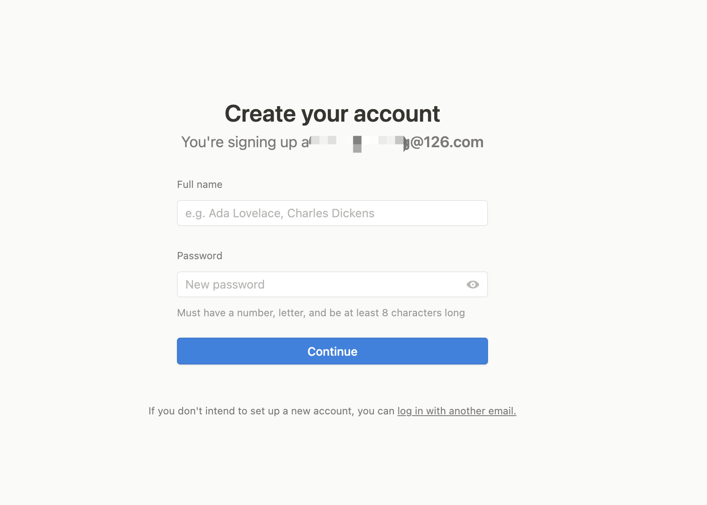
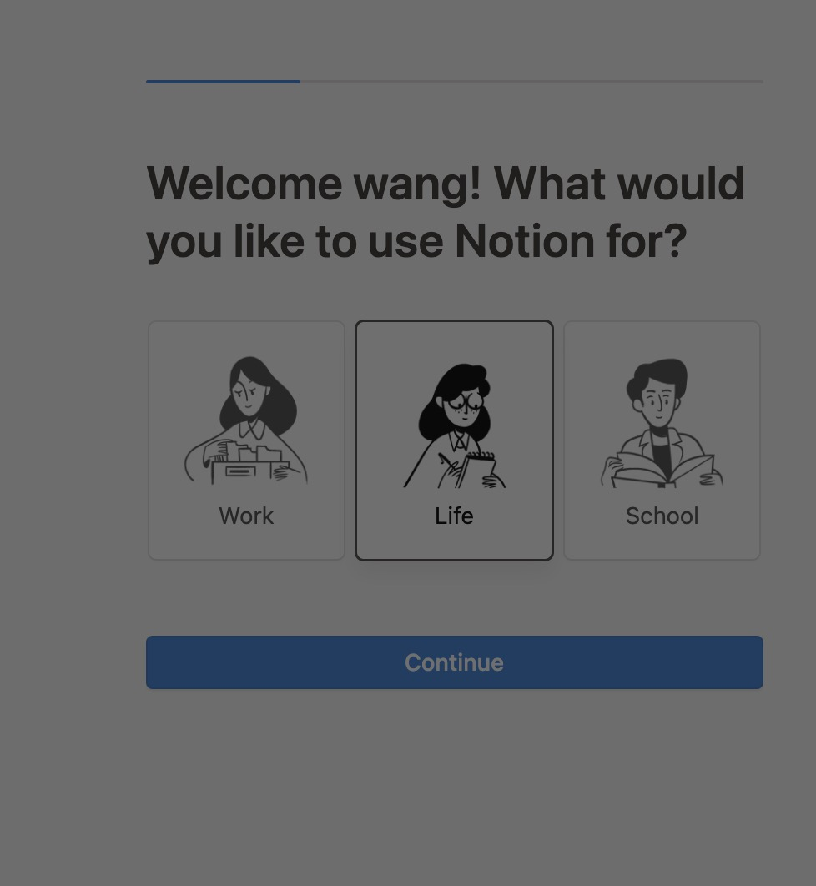
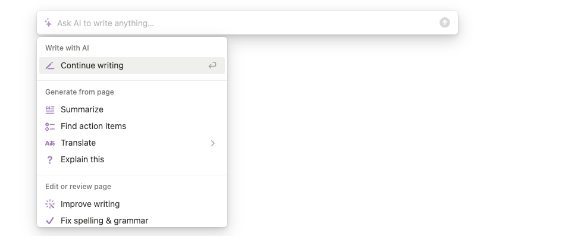
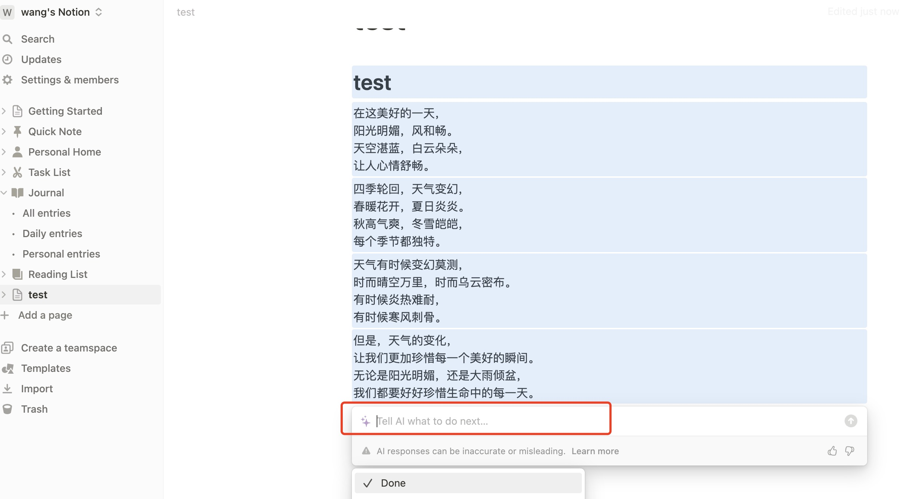

1.地址 
  打开地址 [https://www.notion.so/product/ai](https://www.notion.so/product/ai)  
  
  
  
2.点击 try notion free
 

3.输入邮箱注册 

  
  
4.输入验证码后，点击继续，输入昵称和密码

  

5.可以选择life点击继续
   
   

6.注册成功 新建一个page  正文中输入空格即可出现 askai

   
    
   让ai写一首诗
   
    