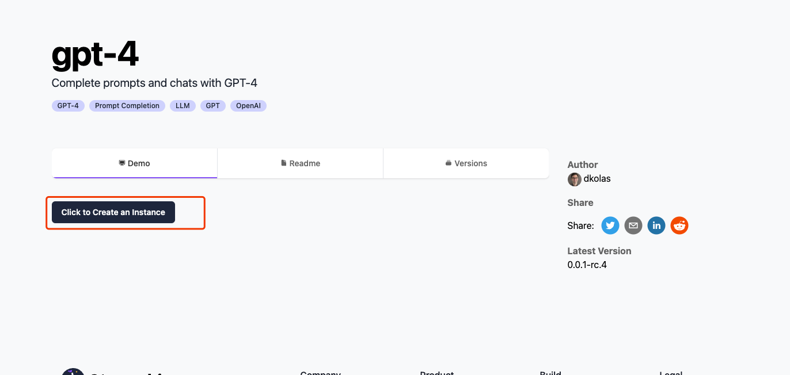

1.地址 
  打开地址 [https://www.steamship.com/](https://www.steamship.com/)  
  
    注册
  
2.注册后到首页点击 GPT-4 Plugin 

   

3.点击 创建实例

  
  
4.把 max_tokens 从默认的 256 改为GPT-4 可以支持的最大值32768 点击 create

  

5. 成功后可以通过web和python来测试
   
   

6.例如

   
    
    